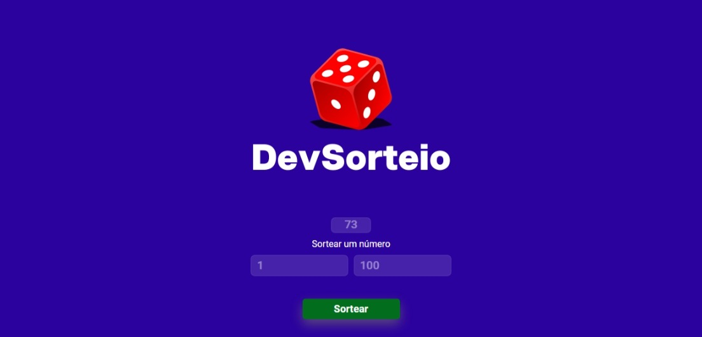

# Random
<h2>
 👋 Hi, Welcome  I'm Wagner !
</h2>

Progress comes gradually, and I'm pleased to advance in another module of the Dev Club programming course.
This new project was done right at the beginning of JavaScript module 3. The essence of this project was to use "Math.random()" which focuses on the generation between the pseudo-random numbers "0" and "1" along with the calculation:
"Math.floor(Math.random() * (max - min + 1) + min)"
With this calculation we can choose two numbers between "0" and any other, far beyond "1, 2, 3, 4, 100, 1914..."
 
 
Teaching platform: 
<a href="https//rodolfomore.com.br/deviclub">DevClub.</a>

    <h3>The following tools were used in this project:</h3>
    
    
    
        
    

 

Skills: Organizational skills · Responsibility · Visual Studio Code · Code review · Organizational commitment · HTML5 · Troubleshooting · Git · Responsive Web Design · Continuous improvement · CSS · GitHub · Good programming practices · Repositories · Resilience · JavaScript · Microsoft Windows

